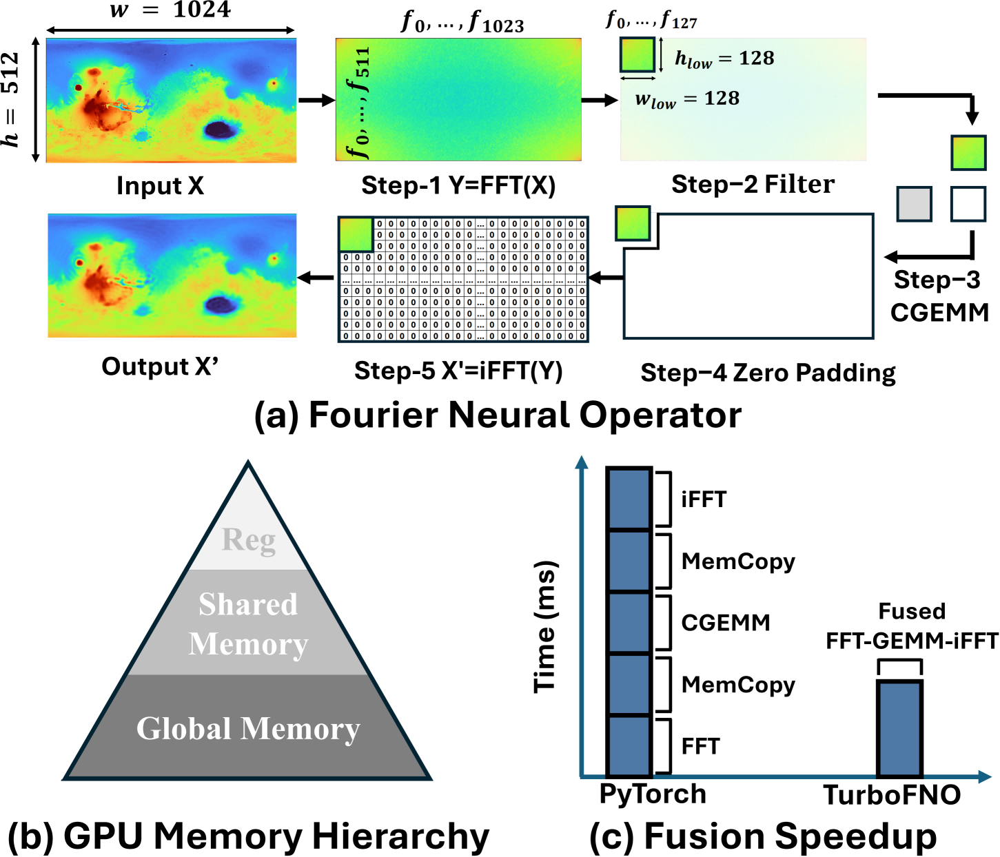

# TurboFNO


**TurboFNO** is a high-performance GPU implementation of the Fourier Neural Operator (FNO), designed for solving PDEs with deep learning. Unlike standard FNO implementations that execute FFT, filtering, GEMM, and iFFT as separate kernels—causing redundant memory traffic—TurboFNO introduces the **first fully fused FFT–GEMM–iFFT GPU kernel** with built-in optimizations.

<p align="center">
  
</p>

TurboFNO includes:

* Custom high-performance FFT and GEMM kernels, matching or exceeding cuFFT and cuBLAS performance;
* Built-in **zero-padding, frequency truncation, and channel pruning** to eliminate unnecessary data movement;
* A novel kernel fusion strategy where **each thread block traverses the hidden dimension**, aligning FFT output with GEMM computation;
* Shared memory swizzling techniques to ensure **100% memory bank utilization** between FFT, GEMM, and iFFT stages.

> On NVIDIA A100, TurboFNO achieves up to **1.5× speedup** over PyTorch and NVIDIA’s closed-source libraries.

---

## 📦 Repository Structure

```
TurboFNO/
├── fusion_variants/           # All kernel fusion variants (stepwise E→A→B→C→D for 1D/2D)
├── benchmark_config/          # Input problem sizes for 1D and 2D
├── TurboFFT/                  # Git submodule (TurboFNO_dev branch)
├── utils/, Common/            # Shared code and support modules
├── install.sh                 # Batch compile and PATH setup script
└── README.md
```

## ⚙️ Setup

1. **Clone the repository**:

   ```bash
   git clone https://github.com/shixun404/TurboFNO.git
   cd TurboFNO
   ```

2. **Initialize the TurboFFT submodule** (required branch: `TurboFNO_dev`):

   ```bash
   git submodule update --init --recursive
   ```

3. **Set the project root environment variable** (used by all CMake builds):

   ```bash
   export PROJECT_ROOT=$(pwd)
   ```

4. **Build all kernel fusion variants (1D and 2D)**:

   ```bash
   bash install.sh
   ```

5. **Temporarily add all compiled binaries to your PATH**:

   ```bash
   source $PROJECT_ROOT/envpath.sh
   ```

6. **\[Optional] Clean all builds**:

   ```bash
   bash install.sh clean
   ```

> 💡 `envpath.sh` only modifies your `PATH` for the current terminal session. It is auto-generated by `install.sh`.

## Run


Currently, only complex-to-complex (C2C) FFTs are supported, and the frequency domain is truncated to size 64 after applying the high-frequency filter.


### Variant Summary (Progressive Kernel Fusion)

| Variant | Executable Name                   | Fusion Strategy                      | Description                    |
| ------- | --------------------------------- | ------------------------------------ | ------------------------------ |
| E       | `TurboFNO_1D_E` / `TurboFNO_2D_E` | No fusion                            | Baseline                       |
| A       | `TurboFNO_1D_A` / `TurboFNO_2D_A` | FFT + GEMM + iFFT (separate kernels) | Initial kernel sequence        |
| B       | `TurboFNO_1D_B` / `TurboFNO_2D_B` | Fused FFT + GEMM                     | First-stage fusion             |
| C       | `TurboFNO_1D_C` / `TurboFNO_2D_C` | FFT + Fused GEMM + iFFT              | Mid-stage fusion               |
| D       | `TurboFNO_1D_D` / `TurboFNO_2D_D` | Fully fused FFT + GEMM + iFFT        | Final optimized implementation |

### Launching a Variant

```bash
TurboFNO_1D_A
```

Sample Output

```bash
1D_A, bs=1   , dimX=1   , DY=128 , N=64  , K=8   , TIME=   0.026ms
1D_A, bs=1   , dimX=1   , DY=128 , N=64  , K=16  , TIME=   0.028ms
1D_A, bs=1   , dimX=1   , DY=128 , N=64  , K=24  , TIME=   0.031ms
1D_A, bs=1   , dimX=1   , DY=128 , N=64  , K=32  , TIME=   0.034ms
1D_A, bs=1   , dimX=1   , DY=128 , N=64  , K=40  , TIME=   0.036ms
1D_A, bs=1   , dimX=1   , DY=128 , N=64  , K=48  , TIME=   0.039ms
```

### Input Format (via `benchmark_config/problem_size_1d.txt` or `problem_size_2d.txt`)

Each variant builds a `TurboFNO` binary that accepts problem size configurations via a **runtime `.txt` config file** (no recompilation needed).

```txt
bs_list = 1 2 4 8 16 32 64
dimX_list = 1
DY_list = 128 256
N_list = 64 128
K_list = 8 16 24 32
```

> ⚠️ If no config path is provided, a default path is compiled in via CMake.


---


## 📊 Expected Stepwise Optimization Result

We progressively optimize the kernel execution from unfused (baseline) to fully fused implementation.
Below are the benchmark visualizations for 1D and 2D cases.

---
### 🔷 1D Kernel Fusion Stages

#### A: FFT + GEMM + iFFT
<p align="center">
  
</p>

#### B: Fused FFT + GEMM
<p align="center">
  
</p>

#### C: FFT + Fused GEMM + iFFT
<p align="center">
  
</p>

#### D: Fully Fused
<p align="center">
  
</p>

---

### 🔶 2D Kernel Fusion Stages

#### A: FFT + GEMM + iFFT
<p align="center">
  
</p>

#### B: Fused FFT + GEMM
<p align="center">
  
</p>

#### C: FFT + Fused GEMM + iFFT
<p align="center">
  
</p>

#### D: Fully Fused
<p align="center">
  
</p>

---

## Kernel Customization

Currently only supports C2C FFT and with size 64 after high-frequency filter.

### 🧠 FFT Kernel Code Generation

FFT kernels are auto-generated. You can customize templates in:

```
TurboFFT/TurboFFT/include/code_gen/generated/...
```

Changes require a rebuild of the corresponding variant.

### ⚙️ GEMM Tiling Configuration

Tuning parameters (e.g., tile sizes, threads per block) are set in:

```
utils/TurboFNO.h
```

These control shared memory layout, tiling, and warp fusion strategies.

---


## 📖 Citation

If you use TurboFNO in your work, please cite:

```bibtex
@article{wu2025turbofno,
  title={TurboFNO: High-Performance Fourier Neural Operator with Fused FFT-GEMM-iFFT on GPU},
  author={Wu, Shixun and Zhai, Yujia and Dai, Huangliang and Zhao, Hairui and Zhu, Yue and Hu, Haiyang and Chen, Zizhong},
  journal={arXiv preprint arXiv:2504.11681},
  year={2025}
}
```
