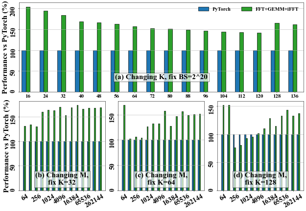
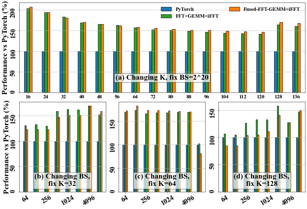
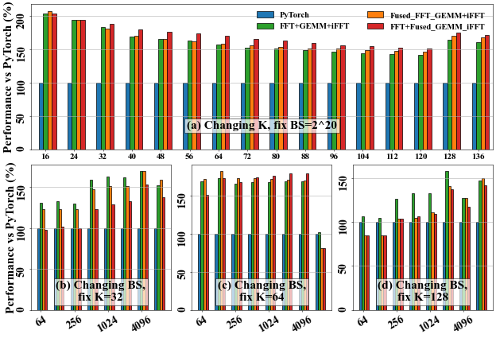
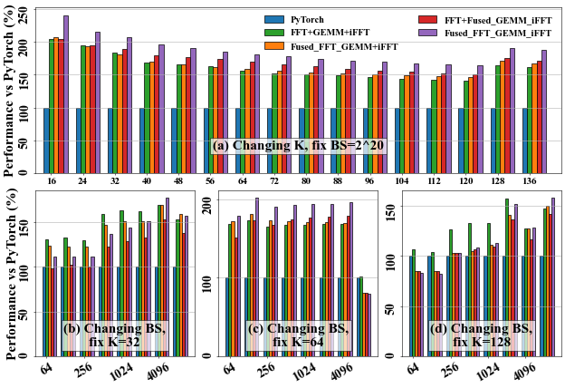
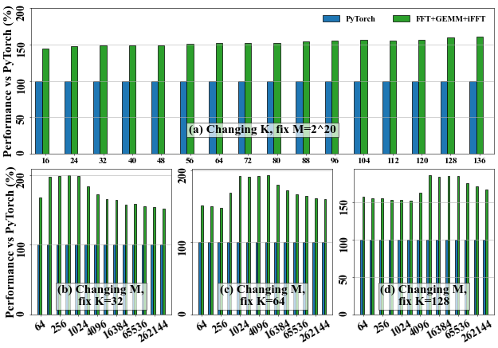
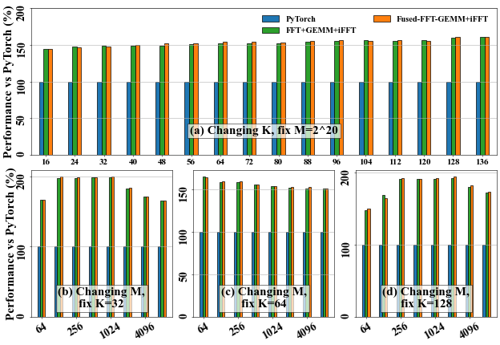
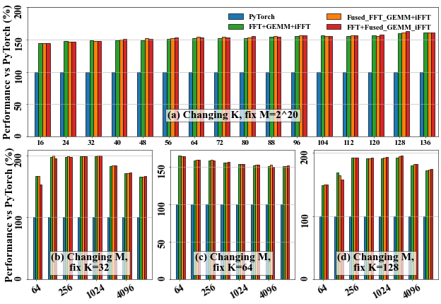
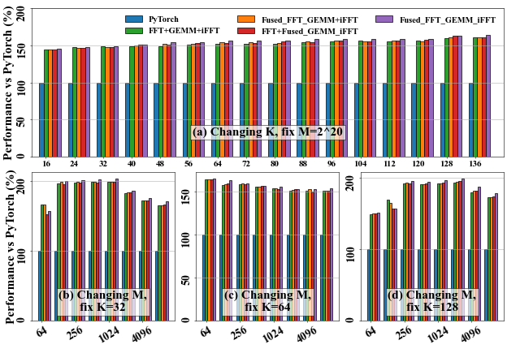

# TurboFNO

TurboFNO is a high-performance, fault-tolerant implementation of the Fourier Neural Operator (FNO), optimized for GPUs through FFT–GEMM–iFFT kernel fusion. It supports progressive kernel fusion strategies and is benchmark-ready on both 1D and 2D FNO workloads.

---

## 📦 Repository Structure

```
TurboFNO/
├── fusion_variants/           # All kernel fusion variants (stepwise E→A→B→C→D for 1D/2D)
├── benchmark_config/          # Input problem sizes for 1D and 2D
├── TurboFFT/                  # Git submodule (TurboFNO_dev branch)
├── utils/, Common/            # Shared code and support modules
├── install.sh                 # Batch compile and PATH setup script
└── README.md
```

## ⚙️ Setup

1. **Clone the repository**:

   ```bash
   git clone https://github.com/shixun404/TurboFNO.git
   cd TurboFNO
   ```

2. **Initialize the TurboFFT submodule** (required branch: `TurboFNO_dev`):

   ```bash
   git submodule update --init --recursive
   ```

3. **Set the project root environment variable** (used by all CMake builds):

   ```bash
   export PROJECT_ROOT=$(pwd)
   ```

4. **Build all kernel fusion variants (1D and 2D)**:

   ```bash
   cd fusion_variants
   bash install.sh
   ```

5. **Temporarily add all compiled binaries to your PATH**:

   ```bash
   source $PROJECT_ROOT/envpath.sh
   ```

6. **\[Optional] Clean all builds**:

   ```bash
   bash install.sh uninstall
   ```

> 💡 `envpath.sh` only modifies your `PATH` for the current terminal session. It is auto-generated by `install.sh`.

## Run

Each variant builds a `TurboFNO` binary that accepts problem size configurations via a **runtime `.txt` config file** (no recompilation needed).

### a. Input Format (via `benchmark_config/problem_size_1d.txt` or `problem_size_2d.txt`)

Currently, only complex-to-complex (C2C) FFTs are supported, and the frequency domain is truncated to size 64 after applying the high-frequency filter.

```txt
bs_list = 1 2 4 8 16 32 64
dimX_list = 1
DY_list = 128 256
N_list = 64 128
K_list = 8 16 24 32
```

### b. Launching a Variant

```bash
TurboFNO_1D_A
```

> ⚠️ If no config path is provided, a default path is compiled in via CMake.


### Variant Summary (Progressive Kernel Fusion)

| Variant | Executable Name                   | Fusion Strategy                      | Description                    |
| ------- | --------------------------------- | ------------------------------------ | ------------------------------ |
| E       | `TurboFNO_1D_E` / `TurboFNO_2D_E` | No fusion                            | Baseline                       |
| A       | `TurboFNO_1D_A` / `TurboFNO_2D_A` | FFT + GEMM + iFFT (separate kernels) | Initial kernel sequence        |
| B       | `TurboFNO_1D_B` / `TurboFNO_2D_B` | Fused FFT + GEMM                     | First-stage fusion             |
| C       | `TurboFNO_1D_C` / `TurboFNO_2D_C` | FFT + Fused GEMM + iFFT              | Mid-stage fusion               |
| D       | `TurboFNO_1D_D` / `TurboFNO_2D_D` | Fully fused FFT + GEMM + iFFT        | Final optimized implementation |


---


### 📊 Expected Stepwise Optimization Result

We progressively optimize the kernel execution from unfused (baseline) to fully fused implementation.
Below are the benchmark visualizations for 1D and 2D cases.

---

### 🔷 1D Kernel Fusion Stages

#### E: Baseline


#### A: FFT + GEMM + iFFT


#### B: Fused FFT + GEMM


#### C: FFT + Fused GEMM + iFFT


#### D: Fully Fused


---

### 🔶 2D Kernel Fusion Stages

#### E: Baseline


#### A: FFT + GEMM + iFFT


#### B: Fused FFT + GEMM


#### C: FFT + Fused GEMM + iFFT


#### D: Fully Fused


---

## Kernel Customization

Currently only supports C2C FFT and with size 64 after high-frequency filter.

### 🧠 FFT Kernel Code Generation

FFT kernels are auto-generated. You can customize templates in:

```
TurboFFT/TurboFFT/include/code_gen/generated/...
```

Changes require a rebuild of the corresponding variant.

### ⚙️ GEMM Tiling Configuration

Tuning parameters (e.g., tile sizes, threads per block) are set in:

```
utils/TurboFNO.h
```

These control shared memory layout, tiling, and warp fusion strategies.

---


## 📖 Citation

If you use TurboFNO in your work, please cite:

```bibtex
@article{wu2025turbofno,
  title={TurboFNO: High-Performance Fourier Neural Operator with Fused FFT-GEMM-iFFT on GPU},
  author={Wu, Shixun and Zhai, Yujia and Dai, Huangliang and Zhao, Hairui and Zhu, Yue and Hu, Haiyang and Chen, Zizhong},
  journal={arXiv preprint arXiv:2504.11681},
  year={2025}
}
```
